# Multiple Maths Quiz

## Interactive Frontend Development Milestone Project

[A Link To Multiple Maths](https://benpruden97.github.io/multiple-maths/)

# Table of Contents

* Testing User Stories(#testing-user-stories)
* Testing Functionality of Project(#testing-functionality-of-project)
* Testing Code Validation(#testing-code-validation)
* Testing Project Performance(#testing-project-performance)
* Testing Project for Different Browsers(#testing-project-for-different-browsers)

# Testing User Stories

### To play a maths game where I can choose which questions I would like to answer.
There is the option to choose between all 4 maths equations questions including addition, subtraction, division and multiplication. There is also a fifth option where the questions asked will be a mix between all 4 maths equations.
### To play a game where I can help improve my current maths skills & knowledge and improve.
Multiple Maths has many different questions types with timer and question amount options to test the user and help improve their maths skills & knowledge.
### I would like to record my top high scores after my game has finished.
Once the user has come to the end of the quiz they will be taken to the game-over.html page where they can enter their name/ username to record their score.
### I would like a How to play option to find out how to play the game.
On the main home page there is a how to play button which displays a popup once the button is clicked, the user can then find information about the quiz and how to play.
### I would like to a contact option to get in contact for any reason such as errors or bugs, questions, or help.
On the main home page there is a contact us button which displays a popup once the button is clicked, this will display a contact form for the user to be able to get in contact with any queries, questions, bugs or errors.
### I would like a timer to find out how much time I have left of the game.
There is a timer on the game page at the top left so the user can see how much time they have left to complete the quiz.
### I would like a question timer to see what question I am currently on.
There is a question timer on the game page at the top right so the user can see what question they are currently on out of the question amount chosen.
### I would like a score counter to see what my current score is.
There is a score counter at the top of the game page that will start at 0 and increase by one everytime the user gets a question correct.
### I would like the answers to change colour or to make a sound to let me know if I have chosen the correct or incorrect answer.
If the user guesses the answer correct then the answer button will change green and red if the user chose the incorrect answer.
### An option of audio to listen to the question as young kids will be playing the game who may struggle to read the questions.
There is an audio option above the question displayed which reads out the current question to the user.
### GitHub & LinkedIn link to see the developer’s previous projects & work/ experience.
There is a link to my GitHub and LinkedIn profile within the footer so the user can see any of my previous projects and work/ experience.

[Back to Table of Contents](#table-of-contents)

# Testing Functionality of Project

### Testing the Play Button on my Home Page to take the user to the Options Page

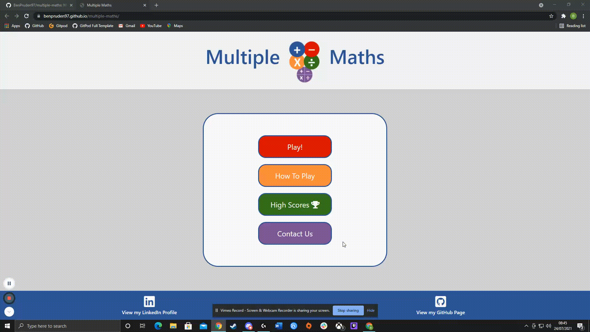

### Testing the How To Play Button on my Home Page

This will display a How To Play pop-up with information about Multiple Maths and how to play the quiz and the different options available.

### Testing the Highscores Button on my Home Page to take the user to the Highscores Page

### Testing the Contact Us Button on my Home Page

This will display a Contact Us pop-up with a contact form for the user to be able to get in touch with any problems, errors, help or questions they may have.

### Testing the Logo at the top of each page

This will take the user back to the Home Page.

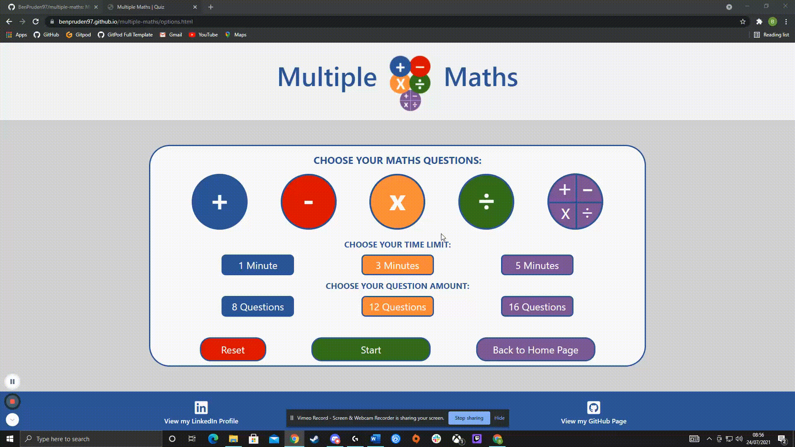

### Testing the Social Links within the Footer

The LinkedIn icon and text will take the user to the developer's LinkedIn profile on a new tab.
The GitHub icon and text will take the user to the developer's GitHub profile on a new tab.

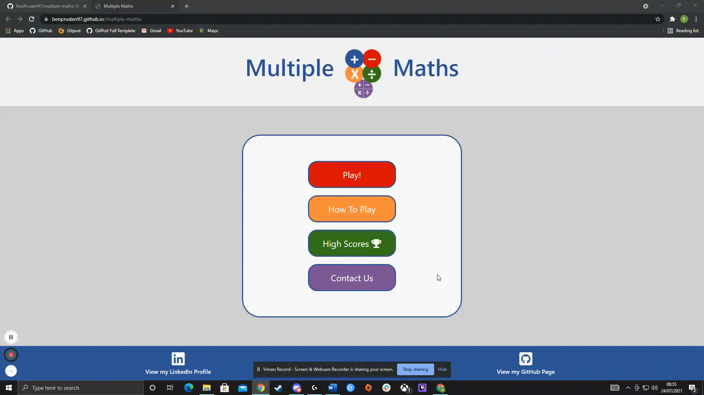

### Testing the Addition question type using the addition, 1 minute timer and 8 questions option

### Testing the Addition question type using the addition, 3 minute timer and 12 questions option

### Testing the Addition question type using the addition, 5 minute timer and 16 questions option

### Testing the Subtraction question type using the addition, 1 minute timer and 8 questions option

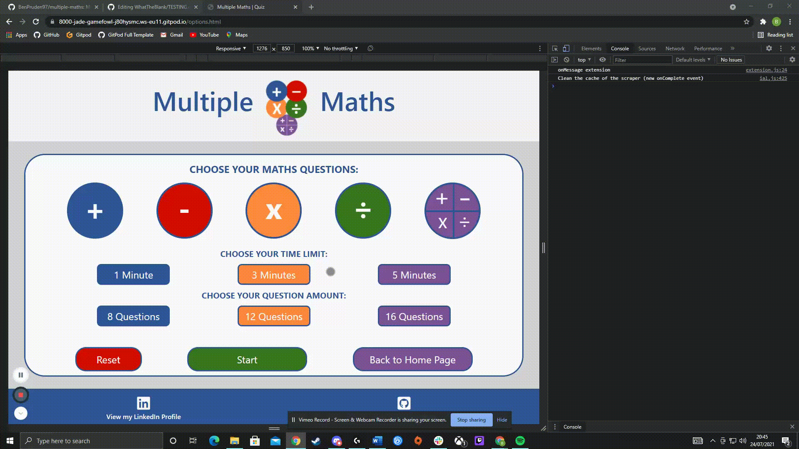

### Testing the Subtraction question type using the addition, 3 minute timer and 12 questions option

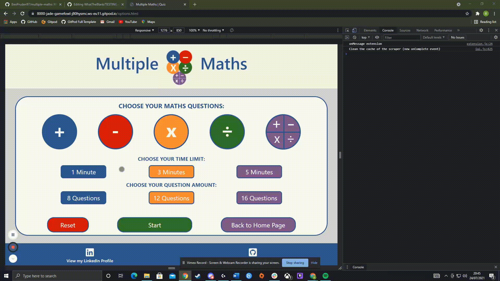

### Testing the Subtraction question type using the addition, 5 minute timer and 16 questions option

### Testing the Mulitplication question type using the addition, 1 minute timer and 8 questions option

### Testing the Mulitplication question type using the addition, 3 minute timer and 12 questions option

### Testing the Mulitplication question type using the addition, 5 minute timer and 16 questions option

### Testing the Division question type using the addition, 1 minute timer and 8 questions option

### Testing the Division question type using the addition, 3 minute timer and 12 questions option

### Testing the Division question type using the addition, 5 minute timer and 16 questions option

### Testing the Multi question type using the addition, 1 minute timer and 8 questions option

### Testing the Multi question Type using the addition, 3 minute timer and 12 questions option

### Testing the Multi question Type using the addition, 5 minute timer and 16 questions option

### The Reset Button will reset the options that the user has chosen if they would like to change anything

### The Start Button will take the user to the game quiz displaying the options chosen by the user

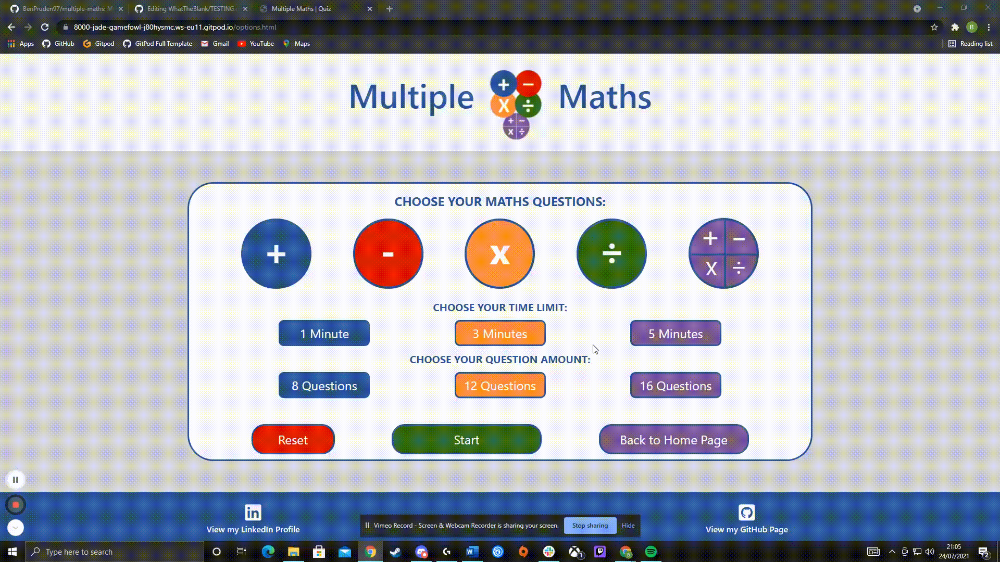

### The Back to Options Menu button will take the user back to the Options Page

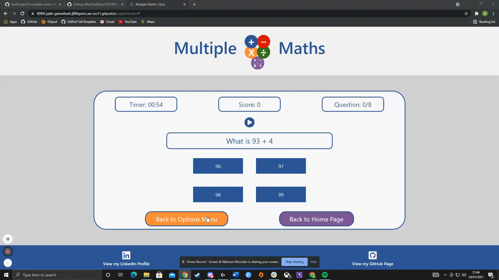

### The Back to Home Page button will take the user back to the Home Page

### Testing the quiz timer to display the countdown timer that the user chose from the options page

### Testing the score counter which displays at 0 when the quiz is started and increase by 1 everytime the user gets a question correct

### Testing the question Amount which displays the current question that is diplaying and the question amount that the user chose from the options page

### Testing the Audio button to read out the current question

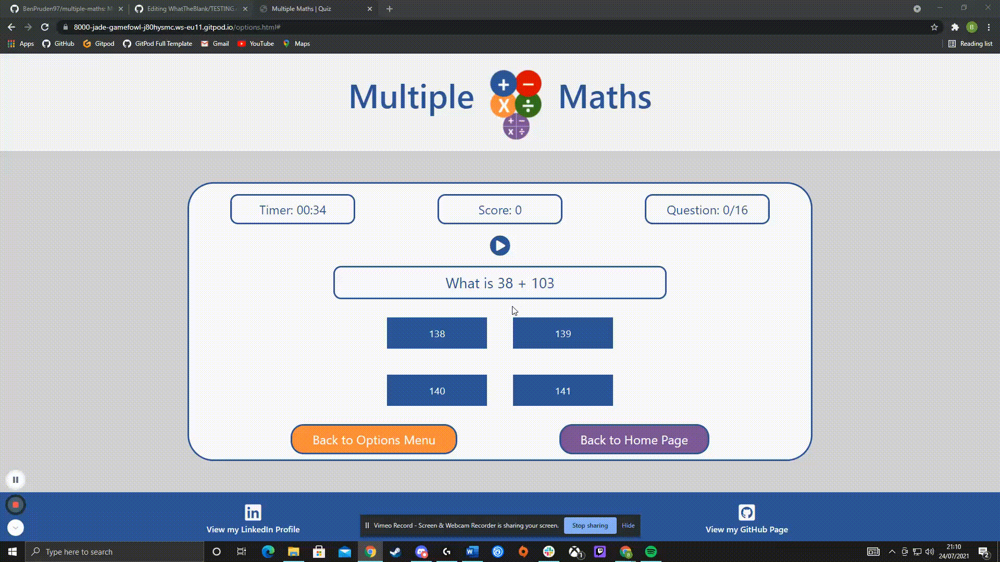

### Testing the answer buttons to change to the correct class if the answer clicked is correct

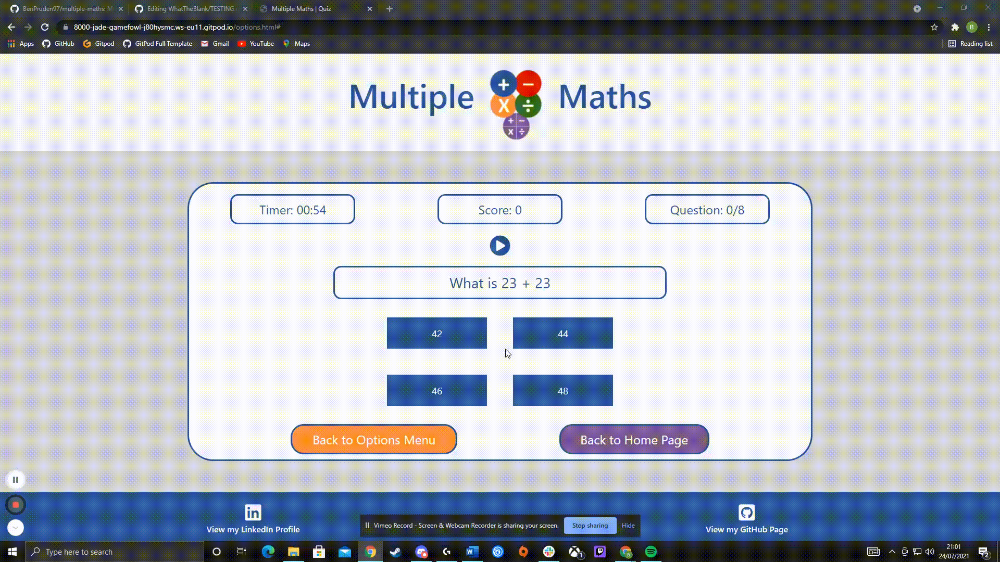

### Testing the answer buttons to change to the incorrect class if the answer clicked is incorrect

### Testing the responsiveness of the home page

### Testing the responsiveness of the options page

### Testing the responsiveness of the game page

### Testing the responsiveness of the game over page

### Testing the responsiveness of the highscores page

[Back to Table of Contents](#table-of-contents)

# Testing Code Validation

Home Page HTML Validation

Most of the errors for my HTML Pages were based on my buttons being displayed within an anchor tag. I kept them this way as I wanted the whoel button to be clickable instead of just the text.

[I used HTML Validator to validate all of my HTML Pages](https://validator.w3.org/)

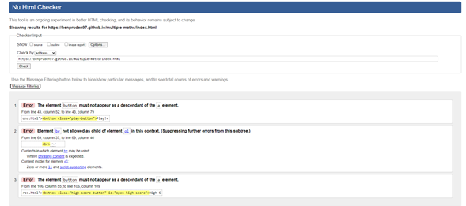

Options Page HTML Validation

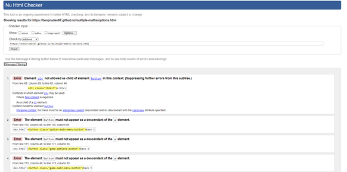

Game Over Page HTML Validation

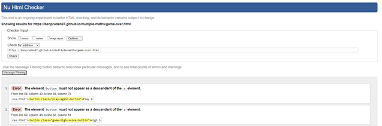

Highscores Page HTML Validation

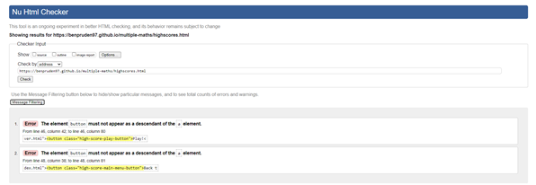

[I used CSS Validator to validate my Style.css Sheet](https://jigsaw.w3.org/css-validator/)

Style.CSS Sheet Validation

The errors within my CSS validation had nothing to do with my actual style.css sheet and no errors appeared.

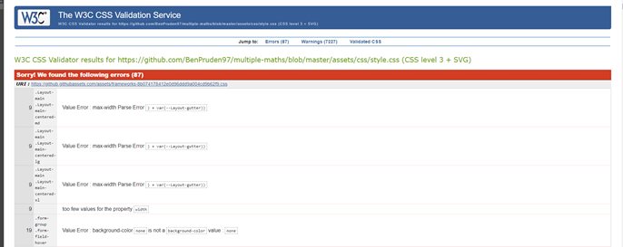

[Back to Table of Contents](#table-of-contents)

JavaScript Validation

[I used JSHint to validate my JavaScript files](https://jshint.com/)

There were a lot of errors for using const and let which I ignored and also for missing semi colons which I have updated.

# Testing Project Performance

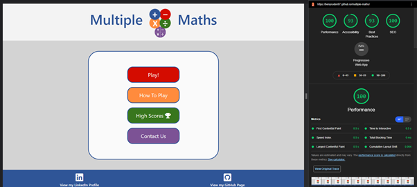

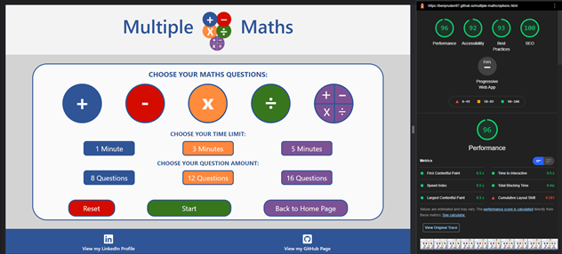

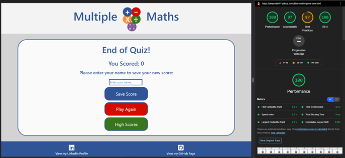

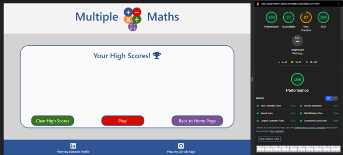

[Back to Table of Contents](#table-of-contents)